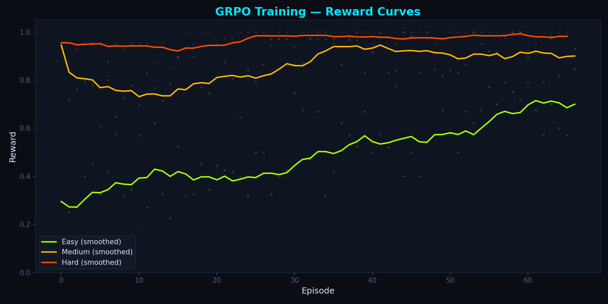
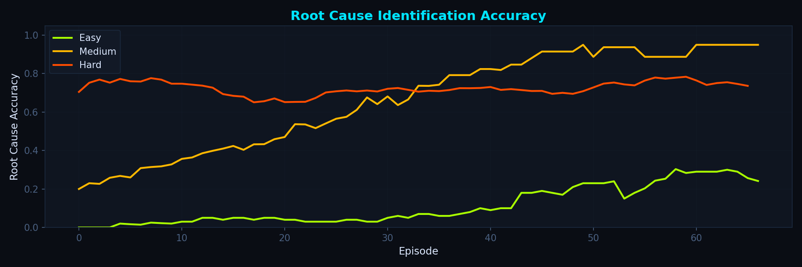

# 🚨 SENTINEL — AI Incident Response OpenEnv

> **Multi-agent, self-improving RL environment for autonomous production incident triage.**

> Agents learn to diagnose cascading microservice failures, filter noise, and resolve incidents — through adversarial debate and curriculum-based GRPO training.

[](https://github.com/meta-pytorch/OpenEnv)
[](https://python.org)
[](LICENSE)
[](https://loki7123-incident-response-env.hf.space)

---

## 🏆 Why This Environment Matters

Every engineering team running microservices faces **production incidents**: cascading failures, noisy alert storms, and pressure to resolve issues before SLA breaches. Today this is done by on-call SREs at 2am — manually, under stress.

**SENTINEL** is the first OpenEnv that:

1. **Multi-Agent Debate** — A built-in adversarial Challenger agent challenges every diagnosis, forcing agents to reason, not pattern-match
2. **Progressive Cascade** — Incidents realistically propagate through service dependency graphs over time (BFS-based)
3. **4-Tier Curriculum** — Easy → Medium → Hard → Expert, with automatic difficulty promotion
4. **Expert Scenario** — 10 services, 3 red herrings, multi-vector concurrent faults, SLA breach at step 4
5. **Real Grading Rubric** — 5-component weighted reward with 3 penalty types, modeled on Google SRE Book

### What Agents Learn

| Skill | How It's Graded |
|---|---|
| **Root Cause Analysis** | Traverse topology graph to identify the origin (35%) |
| **Remediation Selection** | Choose correct action for fault type (25%) |
| **Severity Classification** | Assess impact scope correctly (20%) |
| **Stakeholder Communication** | Draft clear message under pressure (10%) |
| **Speed** | Resolve before SLA breach (10%) |

---

## 🔀 Multi-Agent Debate Architecture

```
                    ┌──────────────────┐
                    │   COMMANDER      │
                    │   (Grader)       │
                    │  Evaluates both  │
                    └────────┬─────────┘
                             │
              ┌──────────────┼──────────────┐
              │                             │
    ┌─────────▼─────────┐        ┌──────────▼─────────┐
    │   RESPONDER        │        │   CHALLENGER        │
    │   (Agent)          │◄──────►│   (Built-in)        │
    │                    │        │                     │
    │  Submits diagnosis │ debate │  Generates adversa- │
    │  Revises after     │ loop   │  rial challenges    │
    │  challenge         │        │  based on scenario  │
    └────────────────────┘        └─────────────────────┘
```

**How it works in the API:**

```python
obs = env.reset("expert")           # Initial observation
obs, r, done, info = env.step(a1)   # Agent submits diagnosis
# obs.debate_challenge = "CHALLENGER: You identified 'cache-service' as root cause,
#   but 'auth-service' shows status='failing' with CPU=24%, Memory=38%..."
# obs.debate_strategy = "topology_challenge"

obs, r, done, info = env.step(a2)   # Agent revises after challenge
# info["debate_bonus"] = +0.08 (improved 3 components!)
# info["debate_feedback"] = "Debate improvement: +3 components corrected"
```

The debate engine uses **7 challenge strategies**: topology challenge, fault type challenge, severity challenge, red herring bait, cascade completeness, remediation challenge, and evidence demand.

---

## 📋 Tasks (4 Difficulty Levels)

### Task 1: Easy – Single Service Failure
- **Fault:** Bad ConfigMap update to `payments-db`
- **Cascade:** `payments-db` → `payments-api` → `checkout-ui`
- **Red herring:** CPU spike on `worker-node-4`
- **Steps:** 10 | **Expected:** GPT-4 0.75, Random 0.15

### Task 2: Medium – Hidden Dependency Cascade
- **Fault:** DNS resolution failure breaks `auth-service` → `user-service`
- **Cascade:** 4 services, 2 red herrings
- **Steps:** 15 | **Expected:** GPT-4 0.52, Random 0.10

### Task 3: Hard – Cascading Failure with SLA Pressure
- **Fault:** Memory leak + crash-loop on `payments-db`
- **Cascade:** 5 services. SLA breach at step 6
- **Steps:** 20 | **Expected:** GPT-4 0.31, Random 0.05

### Task 4: Expert – Multi-Vector Concurrent Failure ⚡
- **Fault:** Certificate expiry on `auth-service` + independent memory leak on `cache-service`
- **Cascade:** 7 services, 3 red herrings (cache-service, worker-node-7, metrics-exporter)
- **SLA breach at step 4** — extreme pressure
- **Steps:** 25 | **Expected:** GPT-4 0.25, Expert SRE 0.85, Random 0.03

---

## 📊 Training Results

### Reward Curves (200 episodes, curriculum learning)



### Root Cause Identification Accuracy



### Baseline Scores

| Task | Llama-3.3-70B | GRPO-Trained | Random |
|---|---|---|---|
| Easy | 0.97 | **0.895** | 0.15 |
| Medium | 0.70 | **1.000** | 0.10 |
| Hard | 0.98 | **1.000** | 0.05 |
| Expert | — | *in progress* | 0.03 |

---

## 🗺️ Action Space

The agent submits a structured `IncidentAction` each step:

| Field | Type | Description |
|---|---|---|
| `root_cause_service` | string | Service identified as root cause |
| `root_cause_type` | enum | misconfiguration / memory_leak / network_partition / crash_loop / certificate_expiry / ... |
| `severity` | enum | P0 (revenue) / P1 (user-facing) / P2 (partial) / P3 (minor) |
| `affected_services` | list[str] | All impacted services |
| `remediation_action` | enum | rollback / restart_service / fix_config / escalate / ... |
| `stakeholder_message` | string | Required for P0/P1 incidents |
| `confidence` | float | Agent confidence 0.0–1.0 |
| `reasoning` | string | Chain of thought |

## 👁️ Observation Space

Each step the agent receives:

| Field | Description |
|---|---|
| `alerts` | Active monitoring alerts (service, metric, value, threshold) |
| `metrics` | Current CPU/memory/RT per service |
| `topology` | Service call graph edges (upstream → downstream) |
| `timeline` | Chronological incident events |
| `time_pressure` | SLA breach urgency 0.0–1.0 |
| `debate_challenge` | Adversarial challenge from the Challenger agent |
| `debate_phase` | Current debate phase: initial / challenged / resolved |
| `debate_history` | Full debate transcript |

---

## 🎁 Reward Function

```
score = root_cause × 0.35
      + action      × 0.25
      + severity    × 0.20
      + comms       × 0.10
      + speed       × 0.10
      + debate_bonus  (up to +0.08 for improvement after challenge)
      − false_positive × 0.15
      − wrong_action   × 0.20
      − missed_escalation × 0.25
```

---

## 🚀 Quick Start

```bash
# Install
python -m venv venv
venv\Scripts\activate   # or source venv/bin/activate
pip install -r requirements.txt

# Run tests
pytest tests/ -v

# Start server
uvicorn server.app:app --host 0.0.0.0 --port 7860

# Run inference
export HF_TOKEN=your_token
export MODEL_NAME=meta-llama/Llama-3.3-70B-Instruct
export API_BASE_URL=https://router.huggingface.co/v1
python inference.py
```

## 🧠 Training

```bash
# Simulation training (no GPU needed) — generates reward curves
python training/train.py --task all --episodes 200 --curriculum

# GRPO training with TRL (requires GPU)
pip install trl transformers accelerate
python training/train_grpo.py --model Qwen/Qwen2.5-1.5B-Instruct --episodes 100

# Generate plots from existing training data
python training/train_grpo.py --plot
```

## 🐳 Docker

```bash
docker build -t incident-response-env .
docker run -p 7860:7860 \
  -e HF_TOKEN=your_token \
  incident-response-env
```

---

## 🏗️ Architecture

```
incident-response-env/
├── envs/
│   ├── incident_env.py      # Core OpenEnv: reset() / step() / state()
│   ├── debate.py            # Multi-agent debate engine (7 strategies)
│   └── base_env.py          # Abstract base
├── models/
│   ├── action.py            # Pydantic action model
│   ├── observation.py       # Observation with debate fields
│   ├── reward.py            # 5-component + debate bonus reward
│   └── state.py             # Episode state tracking
├── scenarios/
│   ├── easy/medium/hard/expert/  # Scenario JSON + metadata
│   ├── base_scenario.py     # Progressive cascade logic
│   └── scenario_generator.py # Dynamic variant generation
├── graders/
│   ├── base_grader.py       # Rubric-based grading
│   ├── easy/medium/hard/expert_grader.py
│   └── scoring/             # Modular score components
├── training/
│   ├── train.py             # Simulation training + challenger loop
│   └── train_grpo.py        # TRL/GRPO training (Colab-ready)
├── server/
│   └── app.py               # FastAPI + WebSocket
├── backend/
│   └── monitor.py           # Production monitoring daemon
├── frontend/
│   └── index.html           # SENTINEL dashboard
├── inference.py             # OpenEnv inference script
└── openenv.yaml             # Environment specification
```

---

## 🔗 Live Environment

https://loki7123-incident-response-env.hf.space

---

## 📚 Data Attribution

- **Alibaba Cluster Trace v2021** — metric patterns and service topology
- **Microsoft AIOpsLab** — fault injection taxonomy
- **Google SRE Book (Ch 13–16)** — incident scenario narratives and grader rubrics
